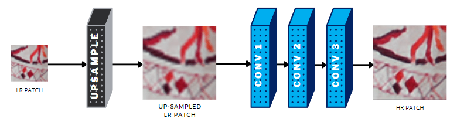
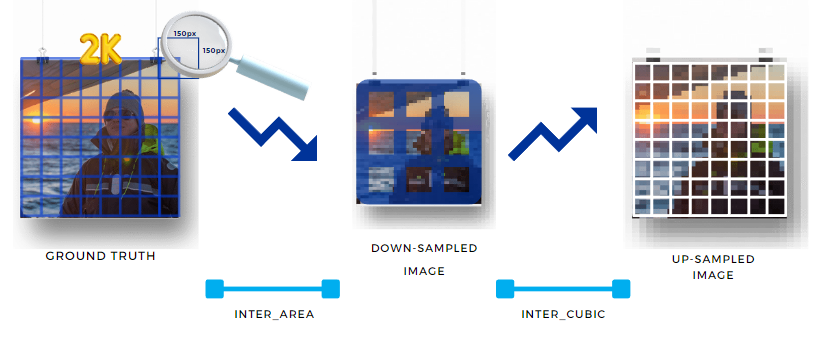
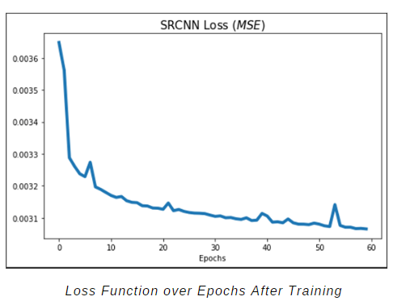
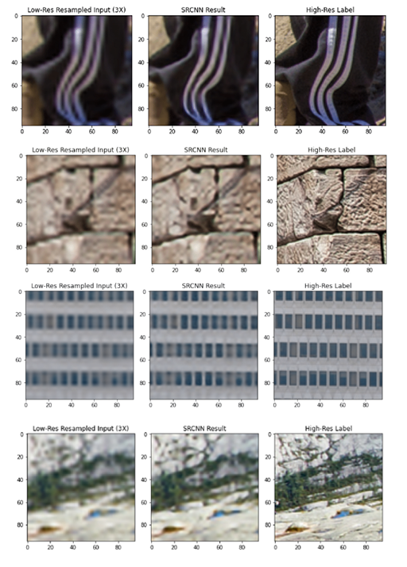

# Single Image Super-Resolution (SISR) 

```
Deep Learning Course Project - Vrije Universiteit Brussel (VUB)
Students: 
- Esteban Velásquez Rendón
- Andrzej Krzysztof Pietrusiak
- Amna Jouini
Professor: 
- Nikos Deligiannis
Program: 
- Msc. Applied Computer Science

Academic Year: 2022
```

Note: The present repository contains the code developed for the project. An explanation of the implemented approach is described below in this README file.



## Summary

Super-resolution imaging is a branch of Computer Vision that improves the resolution of an imaging system. It finds applications in various fields such as medical imaging, satellite imaging, surveillance, astronomical imaging, and digital forensics. Although the domain has advanced significantly, it remains a challenging problem due to the existence of multiple solutions for a low-resolution image. To address this, a deep learning approach called Single Image Super-Resolution (SISR) is introduced, utilizing a Convolutional Neural Network (CNN) architecture with successive convolutions, inspired by sparse-coding based methods. This method aims to learn an end-to-end mapping to generate high-resolution images from low-resolution ones.

## Data Preprocessing

The image preprocessing steps involved in the project are summarized as follows. First, a dataset consisting of 800 high-resolution (2K) images from the DIV2K dataset is selected. The training and testing data are created from these images by cropping them into smaller parts. This approach helps the model to maintain simplicity and generalize well by focusing on high-frequency components. The next step involves subdividing the input ground truth images into patches, increasing the number of training samples and avoiding processing entire 2K images as single samples. A function is implemented to perform this patch extraction process. From the extracted high-resolution patches, the training dataset is generated by performing downsampling (using Area Interpolation) and upsampling (using Bicubic Interpolation) operations three times each. This results in low-resolution patches that have lost information, which the deep learning model aims to recover. The created training patches have the same size as the high-resolution patches but with reduced high-frequency information.



 Other preprocessing techniques applied include train/test split with a ratio of 0.8 for training, normalization of image pixels to a range of 0 to 1, and type conversion to facilitate the use of output data in the pyTorch environment.


## Model Implementation

To accomplish super-resolution (SR) from a low-resolution image, we propose a deep learning approach called single image super-resolution (SR). Our approach involves training an end-to-end mapping using a Convolutional Neural Network (CNN). We implement our method based on the methodology described in a reference paper. To prepare the low-resolution image for the process, we apply some preprocessing steps to upsample it and transform it into the high-resolution space. The architecture of our model is inspired by the sparse coding based method, which is a significant SR technique. It consists of three convolutions: the first one extracts and represents image patches, the second performs non-linear mapping, and the third aggregates the previous representations to achieve the final reconstruction.

Dealing with numerous 2K images that consume significant GPU/CPU resources necessitates careful resource management. To address this, the approach used in the project involves splitting the 2K images into smaller subimages (patches) for more manageable training samples and data augmentation. GPU usage was enabled using CUDA to improve computational efficiency. Despite utilizing a powerful GPU, fine-tuning hyperparameters for optimal results proved time-consuming. However, the obtained results demonstrated promising attempts at achieving super-resolution on various test patches. While there is potential for further improvement by fine-tuning hyperparameters, time constraints limited the exploration. Through extensive experimentation, it was observed that slight adjustments to the learning rate, filter size, and patch size had a significant impact on the results. Different optimizers, such as Adam and SGD, were tested, but no substantial differences in the results were observed.

### Model Architecture:

- First Convolutional Layer: Patch extraction and representation

Tensor of low-resolution patches is fed into first convolutional layer. After performing set of convolution on each of the patches is represented in multiple dimensions (also called feature maps). Performed convolution are used with specyfic padding which outpus results of the same width and height.

- Second Convolutional Layer: Non-Linear Mapping

Next layer maps created feature-maps by previous layer to smaller set of feature maps.

- Third Convolutional layer: Reconstruction

Last step of the model is responsible for squishing tensor recived from the previous layer into output RGB image.

- Activation functions 

Both first and second layer output is taken by Relu activation function, while last layer is left wihout activation

### Training the Model

- Epochs: 60
- Learning Rate: 0.0001
- Patch Size: 96x96 pixels
- Training Samples: 16000 patches
- Batch Size: 16
- Image Scale Factor: x3
- Loss Function: MSE

MSE Loss function shows an expected decline as the model reduces the error over the epochs. The different experiments we tried showed similar plots, except when trying to set the learning rate too big



## Results

